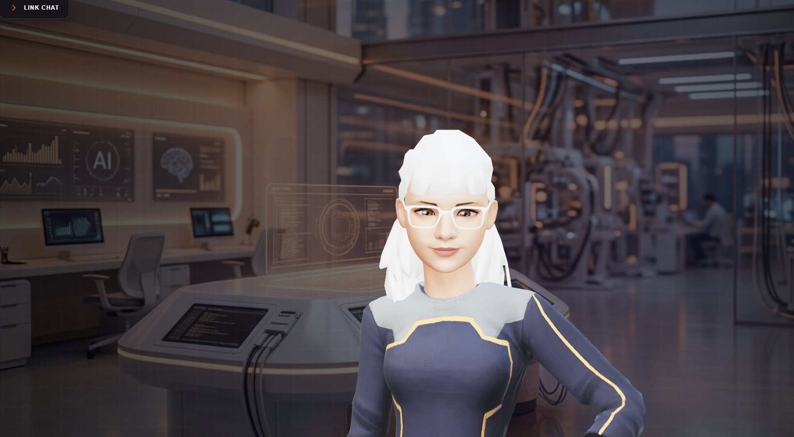

# Iris: Multilingual 3D AI Assistant

Iris is a premium 3D AI assistant that brings natural, conversational interaction to life. Built with a modern **React + FastAPI** stack, she combines low-latency 3D rendering with **Google Gemini** to understand and respond in mixed Urdu/English (Code-Switching) with perfect lip-sync.

---

### 🚀 Key Features

-   **Native Multilingual STT**: Seamlessly understands mixed Urdu and English input.
*   **3D Lip-Syncing**: Real-time viseme analysis for natural mouth movements.
*   **Contextual Brain**: Powered by Gemini 3 Flash with persistent conversation memory.
*   **Quota-Safe Pool**: Automatic rotation between 4 API keys for 100% uptime.
*   **Premium Glass Theory**: Dynamic Theme engine (Dark/Light) with glassmorphic aesthetics.

---

### 🛠️ Tech Stack

| Layer | Technologies |
| :--- | :--- |
| **Frontend** | React 18, Vite, Three.js, Framer Motion |
| **3D Engine** | TalkingHead.js, GLB Morph Targets |
| **Backend** | FastAPI, Python-Multipart, WebSockets |
| **AI Models** | Gemini 3 Flash (Brain), Gemini 2.0 Flash (STT) |

---

### 📂 How It Works

1.  **Listen**: Captures voice via MediaRecorder and sends it to the FastAPI `/transcribe` endpoint.
2.  **Understand**: Gemini 2.0 Flash performs multilingual speech-to-text.
3.  **Process**: The transcript is piped into the WebSocket where Gemini 3 Flash generates a contextual response.
4.  **Speak & Move**: Text is converted to speech; the **TalkingHead** engine calculates visemes from the audio to animate the 3D model in real-time.

---

### ⚡ Quick Start

**Backend**
1. `cd backend && python -m venv venv`
2. `source venv/bin/activate` (or `.\venv\Scripts\activate`)
3. `pip install -r requirements.txt`
4. Create `.env` with `GEMINI_API_KEY=your_key`
5. `uvicorn main:app --reload`

**Frontend**
1. `cd frontend && npm install`
2. `npm run dev`

---

### 📜 License
MIT License
